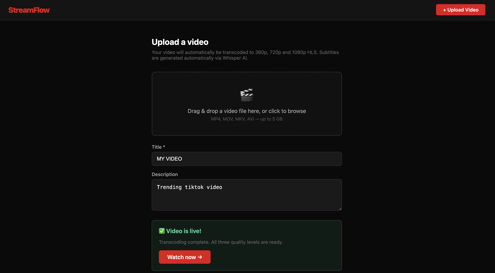
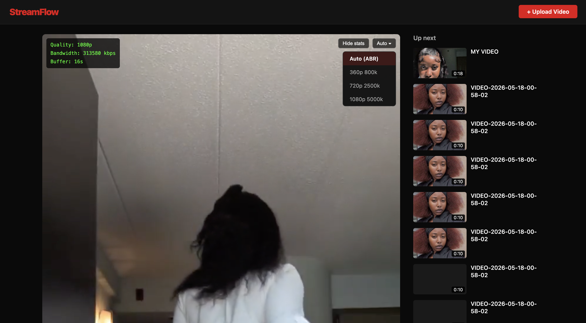
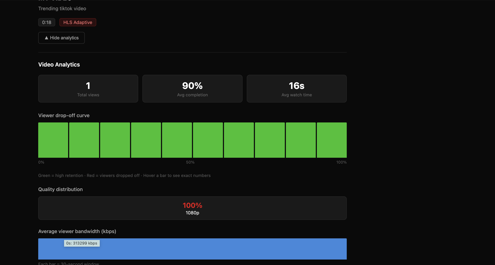

# StreamFlow 

A full-stack adaptive bitrate video streaming platform built with the same core technology used by Netflix, YouTube, and TikTok.

## What is Adaptive Bitrate Streaming?

When you watch Netflix and your internet slows down the video quality drops automatically without buffering. This project implements that from scratch using FFmpeg and HLS.js.

## Demo

## Features

- Video upload with drag and drop support
- Automatic transcoding to 360p, 720p and 1080p using FFmpeg
- HLS adaptive streaming — quality switches automatically based on bandwidth
- Manual quality selector
- Live bandwidth display
- Picture in picture support
- Automatic thumbnail generation
- Viewer analytics — tracks play, pause, seek and heartbeat events
- Drop-off curve showing where viewers stop watching
- Video recommendations sidebar

## Tech Stack

- Node.js + TypeScript
- Express.js
- FFmpeg
- BullMQ + Redis
- PostgreSQL
- AWS S3 / LocalStack
- React + TypeScript
- HLS.js
- Docker

## Getting Started

### Prerequisites

- Node.js 20+
- Docker Desktop
- FFmpeg

### Installation

1. Clone the repository
2. Start infrastructure: `docker-compose up -d`
3. Create S3 buckets:
   `docker exec streaming-platform-localstack-1 awslocal s3 mb s3://raw-videos`
   `docker exec streaming-platform-localstack-1 awslocal s3 mb s3://hls-segments`
4. Run database migration:
   `docker exec -i streaming-platform-postgres-1 psql -U stream -d streamdb < backend/src/db/migrations/001_init.sql`
5. Install dependencies: `cd backend && npm install`
6. Install frontend: `cd frontend && npm install --legacy-peer-deps`

### Running

Open 4 terminal tabs:

Tab 1: `docker-compose up -d`
Tab 2: `cd backend && npm run dev`
Tab 3: `cd backend && npm run worker`
Tab 4: `cd frontend && npm run dev`

Open http://localhost:5173

## License

MIT
